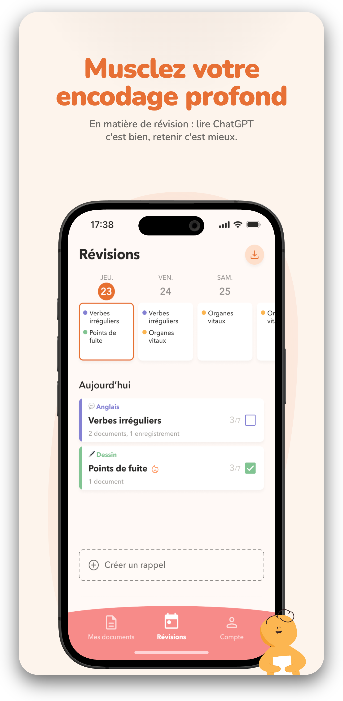
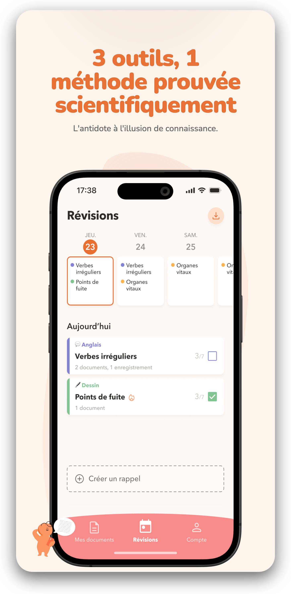
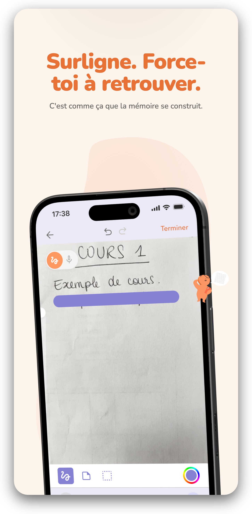
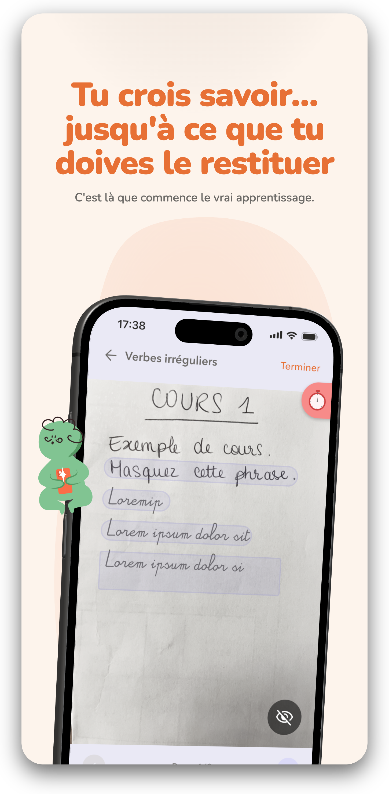
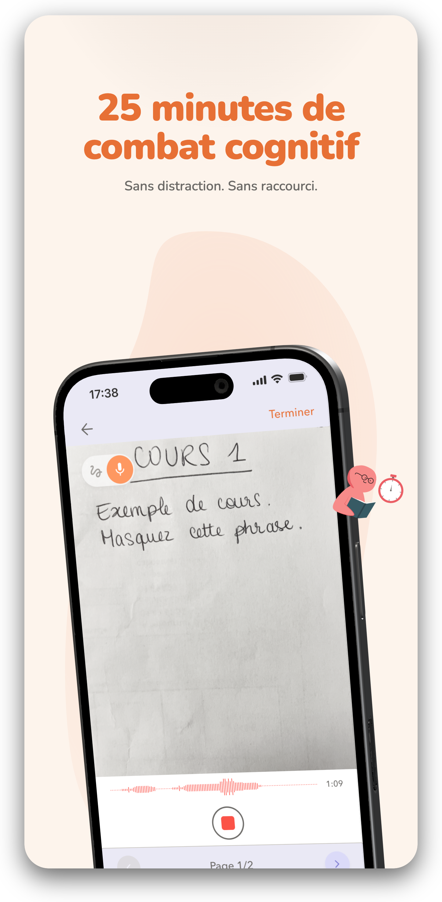
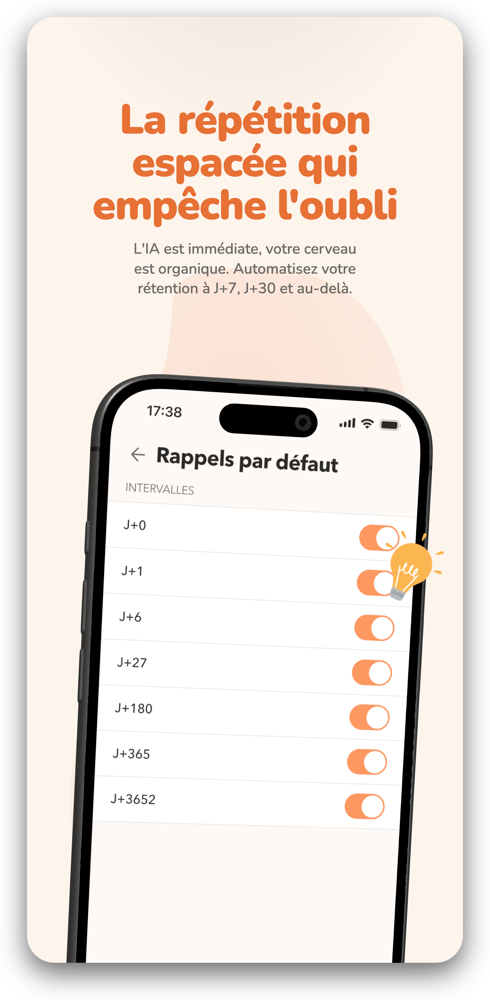
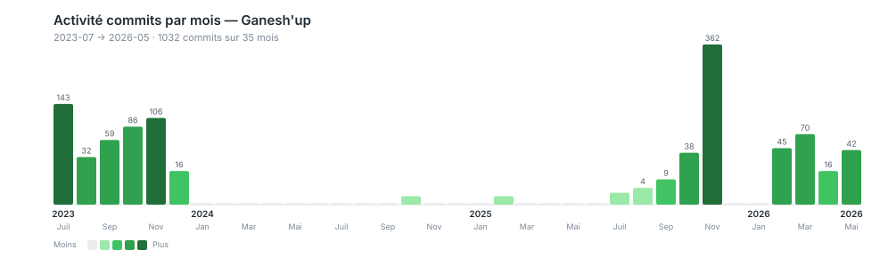

# Ganesh'up — étude de cas technique

App mobile pour bosser sa mémoire, articulée autour de 3 outils : un feutre magique pour cacher/révéler des passages d'une fiche, un Pomodoro intégré, et un système de répétition espacée. Publiée sur l'App Store iOS en mai 2026, en français et anglais.

J'ai porté le projet seul de bout en bout : Flutter côté mobile, Node + Postgres côté backend, infra Docker sur VPS, conformité RGPD et publication App Store.

Le projet a démarré sur une maquette Figma fournie par un designer externe et des allers-retours produit avec le CEO (Mathias Lemaire). [Axel Averly](https://github.com/AxelAv19) a contribué aux premiers mois de prototypage en 2023, surtout sur les écrans de connexion.

---

## Aperçu

  
  
  
  

  
  
  

---

## Stack

Flutter / Dart côté mobile, Node + TypeScript + Prisma + PostgreSQL côté backend. Sentry pour la remontée d'erreurs (mobile et backend), Pino pour les logs serveur. Tout est containerisé Docker, derrière un Nginx, hébergé chez Infomaniak en Suisse.

Pas de framework UI tiers : tous les composants visibles sont dessinés à partir des widgets Flutter de base, pour rester fidèle à la maquette du designer.

---

## Architecture

Côté mobile, c'est une stack en couches assez classique : screens → services → DAOs → SQLite. Les services partagés (HTTP, Auth, Sync) sont des singletons instanciés une seule fois au boot dans `main.dart` et passés par référence aux écrans qui en ont besoin.

Côté backend, j'ai gardé une structure simple à parcourir : routes → middlewares → controllers → services → Prisma. La logique métier ne traîne jamais dans les routes ni dans les controllers, c'est dans les services. Tout payload entrant passe par une validation Joi avant le controller, tout HTML rendu côté serveur est sanitizé par DOMPurify.

---

## Les morceaux dont je suis content

### Le feutre magique

C'est la feature la plus visible de l'app et celle qui m'a demandé le plus d'itérations pour bien sentir au doigt. Pas de lib externe : `Listener` pour la capture des points, `CustomPainter` pour le rendu, et un modèle multi-layers qui permet l'undo/redo et plusieurs outils (feutre, ligne, rectangle, cercle). Le tout sérialisé en JSON pour stocker en SQLite et synchroniser au backend. La première version laguait sur les grosses fiches, j'ai limité les images de fond à 4096px (la limite de texture GPU côté Flutter) pour régler ça.

### Le sync engine

Probablement la partie qui m'a demandé le plus de réflexion. Architecture push/pull avec delta sync, queue persistante des opérations offline (pour qu'elles survivent à un kill de l'app), retry avec backoff exponentiel, et conflict resolution au niveau du champ.

Le cas d'école qui m'a fait pas mal cogiter : deux devices qui modifient le même rappel pendant qu'ils sont offline, lequel gagne au moment du sync ? Pas de réponse universelle, c'est par champ :

- `nextReminderAt` : la date la plus proche gagne. Mieux vaut un rappel en trop qu'un rappel manqué.
- `reminderCount` : le max. On ne perd pas de stats d'historique.
- `isEnabled` : last-write-wins via timestamps. C'est un choix utilisateur, le plus récent reflète son intention.

### Sign in with Apple

J'ai relu la doc Apple plusieurs fois pour bien capter le flux nonce. Côté client, je génère un nonce aléatoire, j'envoie son SHA-256 à Apple, et le raw au backend. Côté serveur, validation du JWT Apple via JWKS distant et vérification que le hash du nonce reçu correspond bien au claim.

Le piège classique : Apple ne renvoie le nom et l'email **qu'à la première connexion**. À toutes les suivantes, c'est null. Si tu ne persistes pas tout de suite, tu as perdu l'info pour toujours.

### La conformité RGPD

Non négociable pour publier en Europe, donc fait sérieusement : export complet des données utilisateur en un clic, suppression de compte avec audit log écrit *avant* la suppression (sinon tu perds la preuve), tracking versionné des consentements, anonymisation du dernier octet d'IP dans tous les logs persistés, cleanup automatique des comptes inactifs au-delà de la durée légale.

Les pages légales sont éditables sans redéploiement via un panel admin que j'ai bricolé (HTML + endpoints Express). Markdown édité côté admin, rendu HTML sanitizé côté public.

### Les notifications

`flutter_local_notifications` avec gestion explicite des timezones (sinon le rappel programmé pour 8h locales se déclenche à 8h UTC, ce qui fait drôle pour un user en Asie). Workers background côté Android (`workmanager`) et iOS (`background_fetch`) pour replanifier la file de notifs chaque jour. Tracking en DB des envois et des ouvertures, en vue d'analytics produit ultérieures.

### Sentry RGPD-first

J'ai passé un peu de temps à tuner la config pour que rien de sensible ne parte chez Sentry : `beforeSend` qui strip les passwords, tokens, contenus de fichiers et headers d'auth ; `sendDefaultPii: false` (pas d'IP, pas de device ID auto) ; `attachScreenshot: false` (sinon une note privée pourrait fuiter dans un rapport d'erreur). Hook isolate pour capter aussi les exceptions des workers background, qui ne remontent pas par défaut.

---

## Tests

Trois niveaux :

- **Unitaire** sur les DAOs, services et helpers (mobile et backend), exécutés sur DB en mémoire pour aller vite et rester déterministe.
- **Intégration** côté backend, contre une vraie Postgres pour valider les cascades, les transactions Prisma et les comportements qui ne se révèlent pas avec des mocks.
- **End-to-end** côté mobile sur les flux qui me faisaient le plus peur en cas de régression : sync multi-device, flux de révision complet, conformité RGPD, upload de fichiers.

Jest + supertest côté backend, `flutter_test` + `sqflite_common_ffi` côté mobile.

---

## Clean code

- Séparation des responsabilités tenue strictement. J'ai dû me retenir plusieurs fois de mettre du Prisma dans un controller (sale) ou de la logique HTTP dans un service (sale aussi).
- Linters actifs et fatals : `avoid_print` enforced sur le code prod Flutter, TypeScript en strict mode côté backend.
- Logs structurés Pino avec correlation IDs propagés sur toute la stack. Quand un user remonte un bug, je peux suivre toute sa requête en filtrant un seul ID, c'est gold.
- Migrations versionnées des deux côtés : sqflite local et Prisma serveur. Pas une seule modif de schéma sans migration tracée.
- Code review systématique avant merge sur main, déploiement uniquement depuis main.

---

## Sécurité

JWT classique avec refresh tokens hashés en base (un dump de DB ne permet pas de rejouer les tokens), bcrypt sur les passwords, rate limiting double couche (Express par endpoint + Nginx en zones globales), validation stricte des payloads, headers de sécurité côté Nginx (HSTS preload, X-Frame, CSP), CORS verrouillé sur les origines autorisées, AES-256-GCM au repos sur les champs sensibles (date de naissance, photo de profil, contenu de fichiers).

**RGPD compliant** : politique de confidentialité et CGU complètes éditables sans redéploiement, export et suppression libre-service depuis l'app, audit logs et consents versionnés, anonymisation des IP, suppression auto des comptes inactifs.

---

## Infra et déploiement

Docker multi-stage pour avoir une image de prod minimaliste : user non-root, `dumb-init` en PID 1 pour un shutdown propre quand SIGTERM arrive. docker-compose orchestre 4 services : Postgres, Redis (provisionné, pas encore utilisé en v1.0), backend Node, Nginx. Healthchecks partout pour que le boot soit ordonné et que docker-compose ne marque pas le backend healthy avant que la DB le soit.

Nginx fait reverse proxy, rate limiting global, et redirige `/privacy` et `/terms` vers les pages legal rendues par le backend, pour que les URLs soient courtes et propres dans App Store Connect.

**Déploiement.** Un script shell qui fait : `git pull` → snapshot pg_dump avant migration → docker build avec le commit SHA injecté pour le release tracking Sentry → restart backend → reload nginx → healthcheck. C'est atomique, ça prend une minute, et le snapshot pré-migration me donne un point de retour si une migration foire.

**Stratégie de backup 3-2-1.** Backup quotidien automatique en cron (rolling daily/weekly/monthly), snapshot supplémentaire à chaque déploiement manuel, réplication offsite sur un VPS de backup Infomaniak séparé géographiquement du prod.

---

## Travail avec les stakeholders

Le designer a livré une maquette Figma fixée en début de projet. Mon job a surtout été de la traduire en composants Flutter custom (sans dépendance UI tierce pour respecter l'identité visuelle), et de gérer dès le début le responsive iPhone/iPad et la localisation FR/EN.

Côté CEO, Mathias Lemaire a porté la vision produit (les 3 outils, la philosophie sans pub ni revente de données) et a relu/validé toutes les copies (description App Store, landing page, CGU, privacy policy).

---

## Activité du projet

  

Le graph raconte assez bien l'histoire : un gros sprint initial à l'été 2023 sur le prototypage, puis une longue pause d'environ un an et demi, et reprise à plein régime à partir d'octobre 2025 pour amener au lancement.

---

## Volume

| Couche | Volume |
|---|---|
| Code Flutter | ~14 k LOC, 131 fichiers Dart |
| Code backend | ~9 k LOC TypeScript |
| Tests | 57 fichiers mobile, 8 suites backend |
| Modèles de données | 16 modèles Prisma, 12 migrations versionnées |
| Plateformes | iOS (App Store), Android et Web buildables |
| Langues | FR, EN |

---

## Developers

| [ Antonin Leprest](https://github.com/Matribuk) | [ Axel Averly](https://github.com/AxelAv19) |
|:---:|:---:|

---

## Liens

- **App Store** : <https://apps.apple.com/us/app/ganeshup/id6755841790>
- **Landing page** : <https://api.autonomind.io/>
- **Politique de confidentialité** : <https://api.autonomind.io/privacy>
- **CGU** : <https://api.autonomind.io/terms>
- **Contact** : Antonin Leprest

